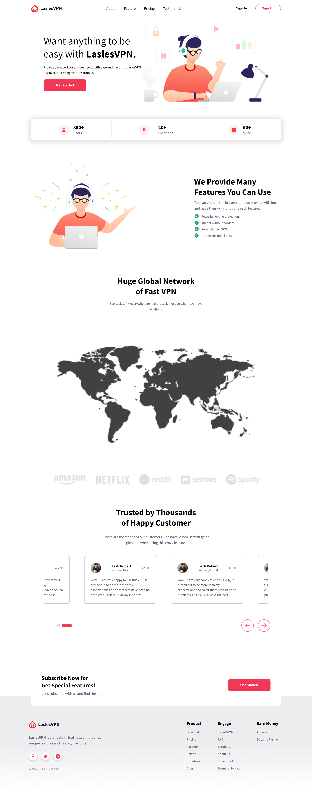

# NextLandingPage 

## Welcome! 👋

Thanks for checking out this front-end coding challenge.

**To do this challenge, you need a basic understanding of HTML, CSS and JavaScript.**

## The challenge

Your challenge is to build out landing page Next and get it looking as close to the design as possible.

You can use any tools you like to help you complete the challenge. So if you've got something you'd like to practice, feel free to give it a go.

Your users should be able to:

- View the optimal layout for the app depending on their device's screen size
- See hover states for all interactive elements on the page
- Use the slider and toggle to see prices for different page view numbers (details provided below)

## Build

- HTML5
- Js
- Sass
- Swipper Js